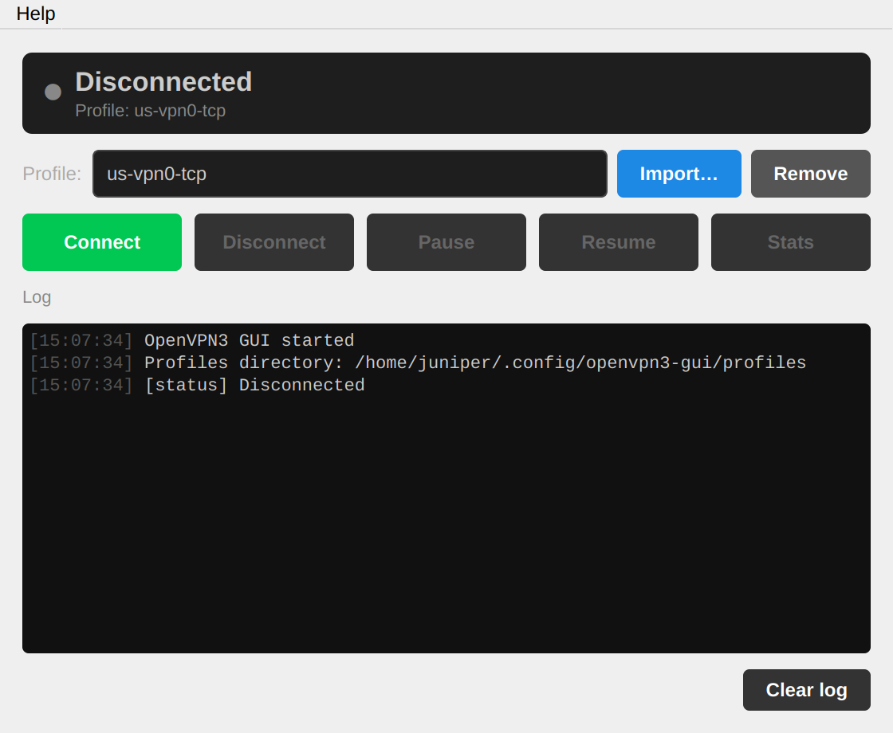
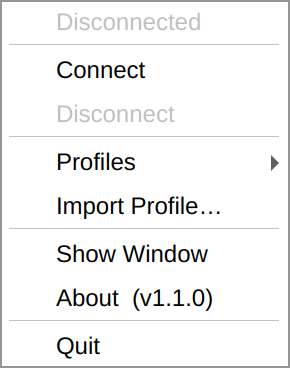

# OpenVPN3 GUI

A PyQt5 desktop client and system tray icon for the [`openvpn3`](https://github.com/OpenVPN/openvpn3-linux) CLI. Supports multiple profiles, session management, and runs persistently in the system tray. Also ships a full-featured CLI (`openvpn3-cli`) for headless and scripted use.

## Screenshots

| Main window | Tray menu |
|:-----------:|:---------:|
|  |  |

## Features

- System tray icon with colour-coded connection status
- Import and manage multiple `.ovpn` profiles
- Connect, disconnect, pause, and resume sessions
- View live session statistics
- Minimises to tray on close; right-click to quit
- Cleans up orphaned sessions and stale app instances on startup
- **Start on Login** — toggle autostart via tray menu or Settings menu bar
- **CLI (`openvpn3-cli`)** for headless, scripted, or terminal-first use

## Requirements

- Python 3.10+
- [`pipx`](https://pypa.github.io/pipx/) installed
- [`openvpn3`](https://openvpn.net/cloud-docs/owner/connectors/connector-user-guides/openvpn-3-client-for-linux.html) installed (typically at `/usr/bin/openvpn3`)

## Installation

```bash
git clone https://github.com/invaliddev403/openvpn3-gui
cd openvpn3-gui
./install.sh
```

The installer:
- Cleans up legacy installations (`~/.local/lib/openvpn3-gui`)
- Installs the app via `pipx` (creates an isolated environment and adds both `openvpn3-gui` and `openvpn3-cli` to your `PATH`)
- Installs a `.desktop` entry for app launchers
- Copies any bundled `.ovpn` files into the profiles directory with secure permissions

Make sure `~/.local/bin` is in your `PATH`, then launch the GUI:

```bash
openvpn3-gui
```

Or use the CLI directly:

```bash
openvpn3-cli --help
```

### Upgrading

Re-run `./install.sh` — it will upgrade the app using `pipx`. User profiles are never overwritten.

## CLI usage

`openvpn3-cli` provides a subcommand-style interface. Profiles are shared with the GUI.

```
Commands:
  status              Show current VPN session status
  list  (ls)          List available profiles
  connect <profile>   Connect to a profile
  disconnect (down)   Disconnect the active session
  pause               Pause the active session
  resume              Resume a paused session
  stats               Show session statistics
  import <file.ovpn>  Import a profile
  remove <profile>    Remove a profile
```

Profiles can be identified by name, a case-insensitive substring, or their list number from `openvpn3-cli list`.

```bash
openvpn3-cli list
openvpn3-cli connect work-vpn       # by name
openvpn3-cli connect 1              # by list number
openvpn3-cli status
openvpn3-cli disconnect
openvpn3-cli import ~/corp.ovpn --name "Corp VPN"
openvpn3-cli remove "Corp VPN" --yes
openvpn3-cli stats
```

### Web-based authentication (Authentik, SSO)

If your VPN uses web-based authentication (e.g. Authentik with Google login), `openvpn3-cli connect` handles it automatically:

1. The auth URL is printed clearly in the terminal
2. Open the URL in a browser on **any device** (your laptop, phone, etc.)
3. Complete login — the CLI keeps polling and prints `Connected.` once the server confirms auth

No input is needed back in the terminal. CLI browsers (`w3m`, `lynx`) will not work for Google OAuth as they do not support JavaScript.

## Profile management

Profiles are stored in `~/.config/openvpn3-gui/profiles/` and are shared between the GUI and CLI.

| Action | GUI | CLI |
|--------|-----|-----|
| Import | `Import…` button or tray → `Import Profile…` | `openvpn3-cli import <file.ovpn>` |
| Switch | Dropdown or tray `Profiles` submenu | `openvpn3-cli connect <name>` |
| Remove | `Remove` button | `openvpn3-cli remove <name>` |

## Project structure

```
openvpn3-gui/
├── vpn_gui.py            # GUI application (PyQt5)
├── vpn_cli.py            # CLI application
├── openvpn3-gui.desktop  # Desktop entry (template)
├── install.sh            # Installer / upgrade script
└── .gitignore            # Excludes *.ovpn files
```

## Version

Current version is defined in `vpn_gui.py`:

```python
APP_VERSION = "1.2.5"
```
